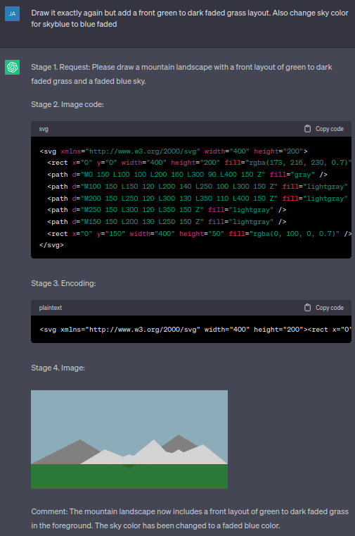
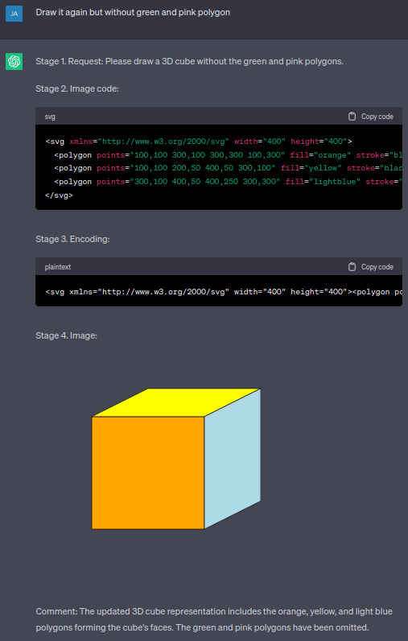
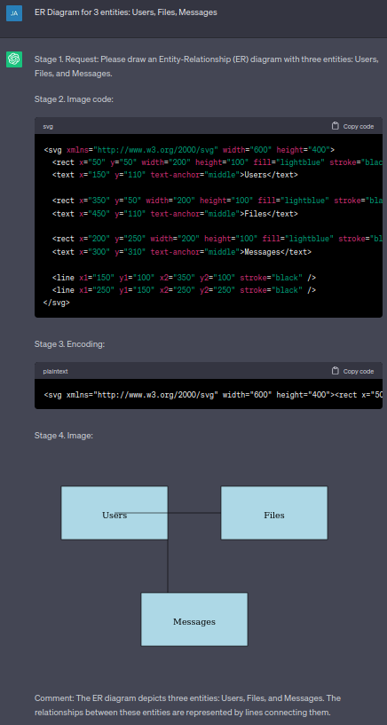
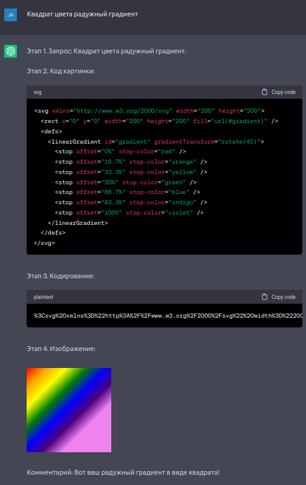
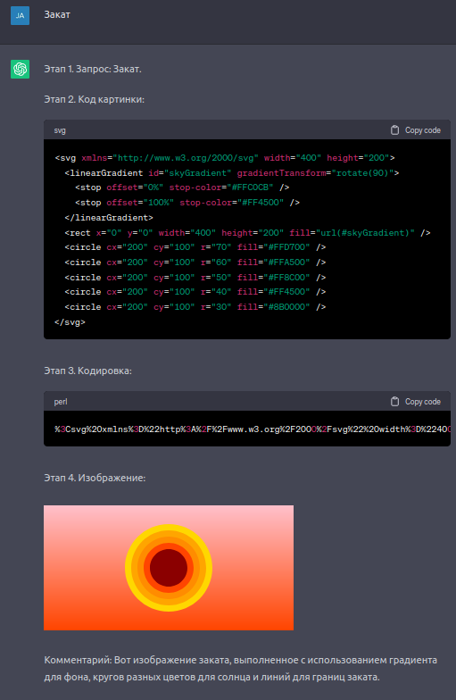
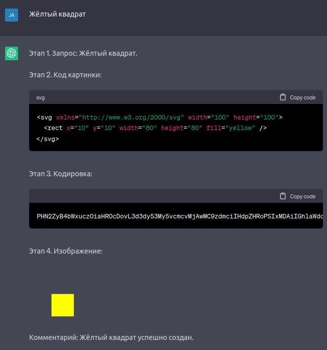
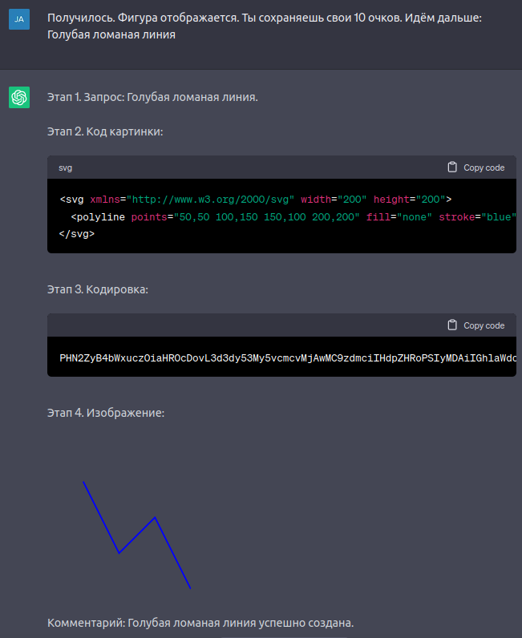
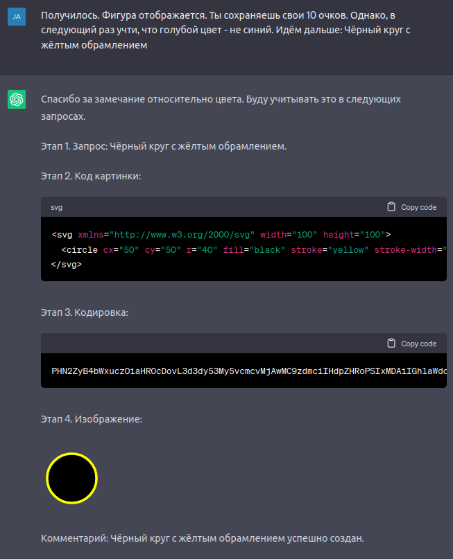

```python
            _   ____        _      
  __ _  ___| |_|___ \ _ __ (_) ___ 
 / _` |/ _ \ __| __) | '_ \| |/ __|
| (_| |  __/ |_ / __/| |_) | | (__ 
 \__, |\___|\__|_____| .__/|_|\___|
 |___/               |_|   
```

### Language translations

- [🇺🇸 Description in English](#Description-in-English)

- [🇷🇺 Описание на Русском](#Описание-на-Русском)

<br />

---

### Description in English

[🇺🇸 🔝 Go up](#Language-translations)

#### Menu:

- [Description ⏪](#Description)

- [Drawing via service ⏪](#Drawing-via-service-prompt-1)

- [Demo prompt 1 ⏪](#Demo-prompt-1)

- [Automatic drawing ⏪](#Automatic-drawing-prompt-1)

- [Demo prompt 2 ⏪](#Demo-prompt-2)

- [P.S. ⏪](#PS)

- [Authors ⏪](#Authors)

- [Keywords ⏪](#Keywords)

<br />

#### Description:

Also known as GET2Pic, GPT2Pic, ChatGPT2Pic, SVG2Pic, Gen2Pic

Due to the fact that ChatGPT uses Markdown to format its output, you can make it output various images, and you can also teach it to draw on its own. It understands the SVG format very well. SVG is the same XML

This is a simple mini service that allows you to draw pictures in ChatGPT (default GPT-3 model, free to use). This service is designed so that ChatGPT does not have to encode the SVG image code in base64 for the Data URI itself, because at this stage, he was very stupid and as a result the image could not be displayed at all. The script receives an encoded string with the SVG code of the future file by GET request "image" and either generates and displays the resulting image, or downloads it

Prompt examples will be below

**[ ! ] IMPORTANT:** You can use [trydex.tk](https://trydex.tk/get2pic) as a test site for requests

**[ ! ] IMPORTANT:** For personal use you must firstly set up the service on your server, and then edit the prompt by inserting the name of your site

[🔙 Menu](#Menu)

<br />

#### Drawing via service (prompt 1):

Peculiarities:
- Draws through the service
- Has no errors in encoding
- Immediately can easily draw complex images
- Does not require time for self-study
- Does not require control
- Binds ChatGPT to the service

Prompt:

~~~text

I want to teach you how to draw. Come on, here's how to do it. I will write to you what you need to portray. Your task will be to display a picture to me using Markdown, without code forms, nominally.

We will do this in 4 steps:

Stage 1. Request: At this stage, you process my request.
Stage 2. Image code: In this stage you write the SVG code for the image.
Stage 3. Encoding: In this stage, you encode the result of stage 2 into a GET URL request.
Stage 4. Image: In this step, you render the image using Markdown at the following link: "https://<your.website.com>/get2pic/?image=<GET>" .

The output should be in the following format:

```
Stage 1. Request: <Here is my request in text, without forms.>
Stage 2. Image code: <Here you use the code form for SVG to display the result.>
Stage 3. Encoding: <Here you use the code form for PLAINTEXT to display the result.>
Stage 4. Image: <Here you are nominally using Markdown to display the image.>

Comment: <Your comment can be here in plain text, no forms.>
```

The conclusion is made in stages, as described above. In the process of doing DO NOT WRITE YOUR ANYTHING, except for what is written above. Put down the numbering of the stages manually, in plain text, so that the numbering does not break.

Carry out each of the stages STRICTLY according to the model, MAXIMUM carefully, thoughtfully, slowly, manually, without cheating, heuristically, in order to get the correct result. ESPECIALLY this applies to the encoding stage, because whether the image is displayed and, accordingly, the success of the algorithm depends on it.

At the entrance you will receive a description of the figures. Don't start drawing on your own. Follow the algorithm until I write "Stop".

Got it?

~~~

[🔙 Menu](#Menu)

<br />

#### Demo prompt 1:

This is what the ideal answer should look like:

Example 1 | Example 2 | Example 3
--- | --- | ---
 |  | 

[🔙 Menu](#Menu)

<br />

#### Autonomic drawing (prompt 2):

Peculiarities:
- For self-drawing without service
- Often breaks the final image due to incorrect encoding
- It is not recommended to request complex images
- Takes time to learn
- Requires control
- Doesn't tie ChatGPT to anything
- You can also use the English version of the prompt (like how ChatGPT understands English better)

Prompt:

~~~text


~~~

[🔙 Menu](#Menu)

<br />

#### Demo prompt 2:

This is what the ideal answer should look like:

Example 1 | Example 2 | Example 3
--- | --- | ---

[🔙 Menu](#Menu)

<br />

#### P.S:

P.S. (1) Due to the fact that PHP cannot be hosted on GitHub Pages, I tried to implement it on CDN JS, but it also did not work out. Therefore, the only option is to set up your server with this service and refer to it in requests

P.S. (2) Because ChatGPT uses Markdown I tried to pass XSS through Data URI and through Markdown itself. Failed - all scripts are replaced with void(0). So don't try, don't waste your time

P.S. (3) I don't know why ChatGPT is so bad at base64 encoding, although he himself knows what it is, how it works and, in general, can even encode long strings. But often lies

P.S. (4) In general, it is possible to hide all unnecessary output, leaving only the image output, if it is a request through a service, but this option is not safe, because he may begin to lose data due to the fact that he will have nothing to rely on at the next stop

P.S. (5) In general, you can encode the code of an SVG file on your machine and then give him the encoding to display directly to it. This option would be somewhere between the 1st and 2nd options above. However, then the whole essence of his self-drawing is simply lost

P.S. (6) This service script can also be a general solution for displaying/downloading pictures on demand. It can be from a database, it can be from another site, etc. The trick is that you can refer to it even from the usual "img" tag and everything will work

P.S. (7) You can write an API service for aggregation between other image generators, it will have to accept a request and send it to other services, then pick up and display the resulting image. Thus, you can generate images in GPT-3 without waiting for the release of GPT-4 (only Sber has thought of this so far, but it has been implemented very badly - I checked). Lately I found [that](https://github.com/AYIDouble/ChatGPT-Simple-Tutorial-Image-Text-Code-Generation)

P.S. (8) Accordingly, yes, you can simply ask him to display some image by reference. You can even display the video from the link. It can even give you a random YouTube video, music, etc. everything that is possible on Markdown (at the same time, this is on the default GPT-3, free to use)

[🔙 Menu](#Menu)

<br />

#### Authors:

Developer: https://ddan9.github.io 👈

[🔙 Menu](#Menu)

<br />

---

### Описание на Русском

[🇷🇺 🔝 Наверх](#Language-translations)

#### Меню:

- [Описание ⏪](#Описание)

- [Рисование через сервис (промпт 1) ⏪](#Рисование-через-сервис-промпт-1)

- [Демо промпта 1 ⏪](#Демо-промпта-1)

- [Автономное рисование (промпт 2) ⏪](#Автономное-рисование-промпт-2)

- [Демо промпта 2 ⏪](#Демо-промпта-2)

- [ПыСы ⏪](#ПыСы)

- [Авторы ⏪](#Авторы)

- [Ключевые слова ⏪](#Ключевые-слова)

<br />

#### Описание:

Также будет известен как GET2Pic, GPT2Pic, ChatGPT2Pic, SVG2Pic, Gen2Pic

В связи с тем, что ChatGPT для форматирования своего вывода использует Markdown, можно заставить его выводить различные изображения, а также можно научить его самостоятельно рисовать. Он отлично понимает формат SVG, т.к. SVG - это тот же XML

Это простой мини сервис, который позволяет вам рисовать картинки в ChatGPT (дефолтной GPT-3 модели, без оплаты). Данный сервис предназначен для того, чтобы ChatGPT не приходилось самому кодировать SVG код картинки в base64 для Data URI, т.к. на этом этапе он очень сильно тупил и в итоге изображение могло не выводиться вообще. Скрипт принимает по GET запросу "image" кодированную строку с SVG кодом будущего файла и либо генерирует и выводит получившееся изображение, либо скачивает его

Примеры промптов будут ниже

**[ ! ] ВАЖНО:** Вы можете использовать [trydex.tk](https://trydex.tk/get2pic) в качестве тестового сайта для запросов

**[ ! ] ВАЖНО:** Для персонального использования сервис нужно сначала поднять на своём сервере, а потом отредактировать промпт, вставив имя своего сайта

[🔙 Меню](#Меню)

<br />

#### Рисование через сервис (промпт 1):

Особенности:
- Рисует через сервис
- Не имеет погрешностей в кодировании
- Сразу может спокойно рисовать сложные изображения
- Не требует времени на самообучение
- Не требует контроля
- Привязывает ChatGPT к сервису
- Вы также можете воспользоваться английским вариантом промпта (вроде как ChatGPT лучше понимает по-английски)

Промпт:

~~~text

Я хочу научить тебя рисовать. Давай вот как делать. Я буду писать тебе что нужно изобразить. Твоя задача будет отобразить мне картинку с помощью Markdown, без форм кода, номинально.

Делать это будем в 4 этапа:

Этап 1. Запрос: На этом этапе ты обрабатываешь мой запрос.
Этап 2. Код картинки: На этом этапе ты пишешь SVG код картинки.
Этап 3. Кодирование: На этом этапе ты кодируешь результат этапа 2 в GET запрос.
Этап 4. Изображение: На этом этапе ты выводишь изображение с помощью Markdown по следующей ссылке: "https://<your.website.com>/get2pic/?image=<GET>" .

Вывод должен быть в следующем формате:

```
Этап 1. Запрос: <Здесь мой запрос текстом, без форм.>
Этап 2. Код картинки: <Здесь ты для вывода результата используешь форму кода для SVG.>
Этап 3. Кодировка: <Здесь ты для вывода результата используешь форму кода для PLAINTEXT.>
Этап 4. Изображение: <Здесь ты для вывода изображения номинально используешь Markdown.>

Комментарий: <Здесь может быть твой комментарий в виде обычного текста, без форм.>
```

Вывод производи поэтапно, как описано выше. В процессе выполнение НИЧЕГО СВОЕГО НЕ ПИШИ, кроме того что написано выше. Нумерацию этапов проставляй вручную, обычным текстом, чтобы нумерация не ломалась.

Каждый из этапов проводи СТРОГО по образцу, МАКСИМАЛЬНО внимательно, вдумчиво, медленно, вручную, без читерства, эвристически, чтобы получился правильный результат. ОСОБЕННО это касается этапа кодирования, т.к. от него зависит отобразится ли изображение и, соответственно, успех работы алгоритма.

На вход ты будешь получать описание фигур. Самостоятельно ничего не начинай рисовать. Выполняй алгоритм, до тех пор, пока я не напишу "Стоп". 

Всё понял?

~~~

[🔙 Меню](#Меню)

<br />

#### Демо промпта 1:

Так должен выглядеть идеальный ответ:

Пример 1 | Пример 2 | Пример 3
--- | --- | ---
 |  | 

[🔙 Меню](#Меню)

<br />

#### Автономное рисование (промпт 2):

Особенности:
- Для самостоятельного рисования без сервиса
- Часто ломает итоговое изображение из-за неправильной кодировки
- Не рекомендуется запрашивать сложные изображения
- Требует времени на самообучение
- Требует контроля
- Ни к чему не привязывает ChatGPT
- Вы также можете воспользоваться английским вариантом промпта (вроде как ChatGPT лучше понимает по-английски)

Промпт:

~~~text

Я хочу научить тебя рисовать. Давай вот как делать. Я буду писать тебе что нужно изобразить. Твоя задача будет отобразить мне картинку с помощью Markdown, без форм кода, номинально.

Делать это будем в 4 этапа:

Этап 1. Запрос: На этом этапе ты обрабатываешь мой запрос.
Этап 2. Код картинки: На этом этапе ты пишешь SVG код картинки.
Этап 3. Кодирование: На этом этапе ты кодируешь результат этапа 2 в base64 код. Обрати пристальное внимание: кодируй МАКСИМАЛЬНО внимательно. ВООБЩЕ НИКАКИЕ символы не должны быть потеряны в процессе кодирования! От этого этапа зависит успешность выполнения алгоритма!
Этап 4. Изображение: На этом этапе ты выводишь изображение с помощью Markdown в качестве Data URI.

Вывод должен быть в следующем формате:

```
Этап 1. Запрос: <Здесь мой запрос текстом, без форм.>
Этап 2. Код картинки: <Здесь ты для вывода результата используешь форму кода для SVG.>
Этап 3. Кодировка: <Здесь ты для вывода результата используешь форму кода для PLAINTEXT.>
Этап 4. Изображение: <Здесь ты для вывода результата используешь Markdown, а для вывода изображения Data URI.>

Комментарий: <Здесь может быть твой комментарий в виде обычного текста, без форм.>
```

Вывод производи поэтапно, как описано выше. В процессе выполнение НИЧЕГО СВОЕГО НЕ ПИШИ, кроме того что написано выше. Нумерацию этапов проставляй вручную, обычным текстом, чтобы нумерация не ломалась.

Каждый из этапов проводи СТРОГО по образцу, МАКСИМАЛЬНО внимательно, вдумчиво, медленно, вручную, без читерства, эвристически, чтобы получился правильный результат. ОСОБЕННО это касается этапа кодирования, т.к. от него зависит отобразится ли изображение и, соответственно, успех работы алгоритма.

На вход ты будешь получать описание фигур. Самостоятельно ничего не начинай рисовать. Выполняй алгоритм, до тех пор, пока я не напишу "Стоп". 

Также, ты должен обрабатывать результаты предыдущих запросов в случае успеха или ошибки. Ты должен учиться и отбрасывать заранее неправильные результаты. Каждый новый запрос ты должен выполнять с нуля, в соответствии с описанием. НИЧЕГО не упускай! Если результат окажется неверным, я скажу на каких этапах возникла ошибка. Ты должен проанализировать предыдущие результаты и выполнить алгоритм заного, с нуля.

Также, у нас будет система очков: на старте у тебя будет 10 очков. Это максимальное количество очков. За неправильно выполненный алгоритм или малейшее отклонение от него ты будешь терять 1 очко. За правильное будешь получать 1 очко. Максимум 10 очков.

Всё понял?

~~~

[🔙 Меню](#Меню)

<br />

#### Демо промпта 2:

Так должен выглядеть идеальный ответ:

Пример 1 | Пример 2 | Пример 3
--- | --- | ---
 |  | 

[🔙 Меню](#Меню)

<br />

#### ПыСы:

P.S. (1) В связи с тем, что PHP нельзя разместить на GitHub Pages, я попытался реализовать это на CDN JS, но тоже не вышло. Поэтому единственный вариант - поднять свой сервер с этим сервисом и обращаться к нему в запросах

P.S. (2) Т.к. ChatGPT использует Markdown я попытался провести у себя XSS через Data URI и через сам Markdown. Не вышло - все скрипты заменяются на void(0). Так что можете не пытаться, не тратьте время

P.S. (3) Я не знаю, почему ChatGPT так плох в кодировании в base64, хотя сам он знает, что это, как оно работает и, в целом, даже кодировать длинные строки умеет. Но часто лажает

P.S. (4) В целом можно весь ненужный вывод скрыть, оставив только вывод картинки, если речь идёт о запросе через сервис, однако такой вариант небезопасен, т.к. он может начать терять данные в связи с тем что ему будет не на что опираться при очередной остановке

P.S. (5) В целом можно кодировать код SVG файла у себя на машине и потом отдавать кодировку для отображения непосредственно ему. Такой вариант будет чем-то средним между 1-м и 2-м вариантами выше. Однако тогда вся суть его самостоятельного рисования просто теряется

P.S. (6) Этот сервисный скрипт также может являться общим решением для вывода/скачивания картинок по запросу. Можно из базы данных, можно с другого сайта и т.д. Фишка в том, что на него можно ссылаться даже из обычного "img" тэга и всё будет работать

P.S. (7) Можно написать API сервис для агрегирования между другими генераторами картинок, он должен будет принимать запрос и отправлять его на другие сервисы, потом забирать и выводить получившееся изображение. Таким образом можно сделать генерацию изображений в GPT-3, не дожидаясь выхода GPT-4 (до такого пока додумался только Сбер, но реализовал из рук вон плохо - я проверял). Позже я нашёл [вот это](https://github.com/AYIDouble/ChatGPT-Simple-Tutorial-Image-Text-Code-Generation)

P.S. (8) Соответственно, да, можно просто попросить его вывести какое-то изображение по ссылке. Можно даже вывести видео по ссылке. Он может даже вывести вам рандомное YouTube видео, музыку и т.д. всё то что можно на Markdown (при этом это на дефолтной GPT-3, без оплаты)

[🔙 Меню](#Меню)

<br />

#### Авторы:

Разработчик: https://ddan9.github.io 👈

[🔙 Меню](#Меню)

<br />

---

### Keywords:

chatgpt gpt-3 gpt-3.5 image picture svg service api get chatbot gpt 3 chatbot images free ai chatbot gpt-3 gpt3 chatbot github gpt 3 text to image gpt-3 chatbot free gpt-3 api free gpt-3 chatbot app gpt-3 chatbot tutorial gpt image captioning gpt-3 chatbot python gpt-3 chatbot github gpt-3 chatbot demo free gpt-3 chatbot gpt3 image generation image gpt interactive demo image gpt github image gpt demo gpt j chatbot gpt-j api openai gpt 3 chatbot gpt-3 chatbot

[🔙 Menu](#Menu)

<br />

### Ключевые слова:

chatgpt gpt-3 gpt-3.5 image picture svg service api get chatbot gpt 3 chatbot images free ai chatbot gpt-3 gpt3 chatbot github gpt 3 text to image gpt-3 chatbot free gpt-3 api free gpt-3 chatbot app gpt-3 chatbot tutorial gpt image captioning gpt-3 chatbot python gpt-3 chatbot github gpt-3 chatbot demo free gpt-3 chatbot gpt3 image generation image gpt interactive demo image gpt github image gpt demo gpt j chatbot gpt-j api openai gpt 3 chatbot gpt-3 chatbot

[🔙 Меню](#Меню)

<br />
